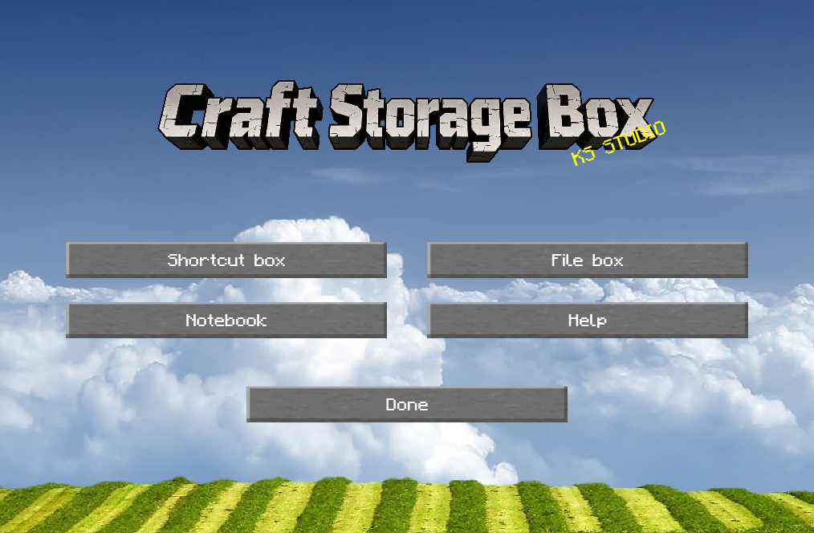
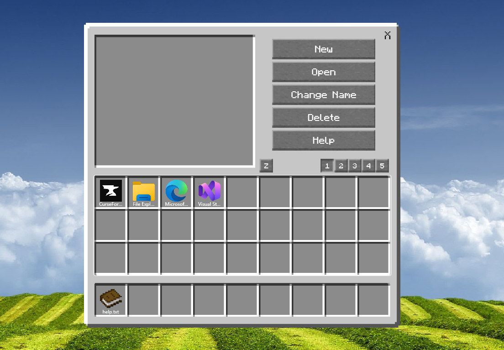
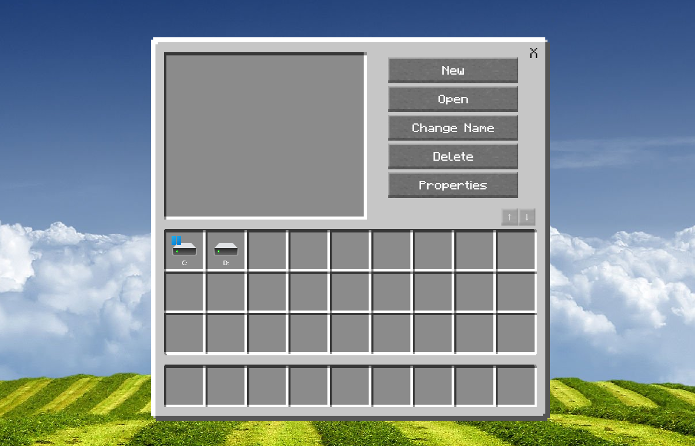
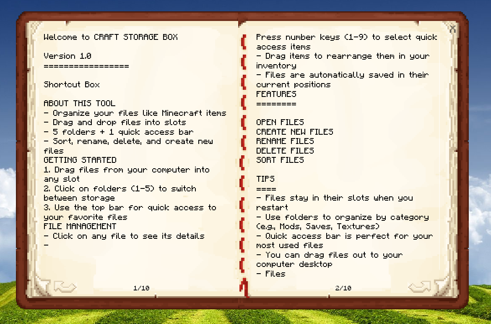

# Craft Storage Box

Organize your files like Minecraft items!

---

## Features

### Minecraft-inspired Inventory UI
- 3×3 grid layout for file slots
- Drag and drop files into slots
- Visual file icons with filenames displayed below

### 5 Storage Folders
- Switch between 5 dedicated folders (1-5)
- Each folder holds up to 27 items
- Perfect for organizing by category (Mods, Saves, Textures, etc.)

### Quick Access Bar 
- 9-slot quick access bar at the top
- Store your most used files
- Files stay in their slots even after restart

### File Operations
- **Create Files**: Create new .txt files directly from the app
- **Open Files**: Double-click or use Open button
- **Rename Files**: Rename files with confirmation
- **Delete Files**: Move files to Recycle Bin (never lose files!)
- **Sort Files**: Sort files alphabetically

### Drag & Drop
- **Drag In**: Drag files/folders from Windows Explorer into the app
- **Drag Out**: Drag files/folders out to your desktop or any folder
- **Rearrange**: Drag items within the grid to rearrange positions
- **Move Between**: Drag items between folders or to quick access bar

### File Browser
- Browse your local file system
- Drive view and folder navigation
- Quick access bar integrated

### Book Reader
- Built-in book-style reader for .txt files
- Page flipping with sound effects
- Page number navigation
- Edit button to open in default editor
- Auto-save when closing

### Position Persistence
- All file positions saved automatically
- Loads exact same layout on startup
- Separate config files for each window

---

## Getting Started

1. Launch the application
2. Drag files from your computer into any slot
3. Click on folder buttons (1-5) to switch between storage folders
4. Use the top quick access bar for your most used files
5. Double-click files to open them
6. Drag files out to your desktop when needed

---

## Interface

### Main Window
- 9 quick access slots at the top
- 3×9 inventory grid (27 slots)
- Folder selector buttons (1-5)
- Action buttons (Open, Rename, Delete, Sort, New)

### FileBrowser Window
- File system browsing
- Quick access bar
- Drive and folder navigation
- Same drag & drop capabilities

### Book Window
- Book-style text reader
- Left/Right page navigation
- Page number display and jump
- Edit button for external editing
- Auto-save on close

---

## Tips

- Files automatically stay in their slots when you restart
- Use folders to organize files by project or category
- Quick access bar is perfect for frequently used files
- Drag files out to your computer desktop
- Files are never permanently deleted - just moved to Recycle Bin
- Max 27 items per folder, max 9 items in quick access bar

---

## Version

Craft Storage Box Version 1.0

By KS STUDIO
